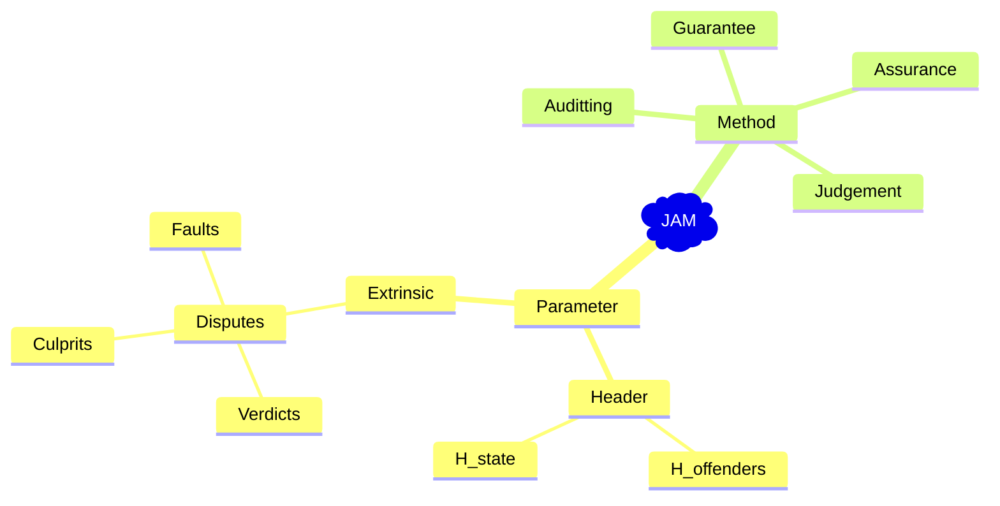

# JAM Protocol Implemetation


## Documentation

Our development documentation is maintained on HackMD for real-time collaboration and easy updates.



### Access Documentation
- Main documentation: [HackMD Development Guide](https://hackmd.io/8ckvpUULSp-HqThsxXE3jg)
- Requires team member access - please contact project maintainers if you need access

## Coding Style

Our codebase follows the [Google Go Style Guide](https://google.github.io/styleguide/go/) for consistent and maintainable code.

1. Installation:

```bash
# macOS
brew install golangci-lint

# Windows
scoop install golangci-lint

# Linux/Ubuntu
Golangci-lint is available inside the majority of the package managers.

# Using Go (all platforms)
go install github.com/golangci/golangci-lint/cmd/golangci-lint@latest
```

2. Run lint check in project root:
```bash
golangci-lint run
```

Following these guidelines helps maintain code quality and ensures consistency across the project.

## Code Formatting

We use `gofmt` to maintain consistent code formatting. [Here](./READMERef/code-formatting.md) are the commands you can use.


## Commit massage
Please stick to [here](./READMERef/semantic-commit-messages.md) when you are going to submit a commit.
