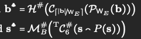
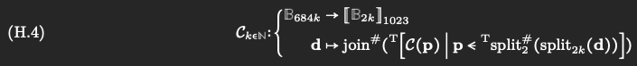
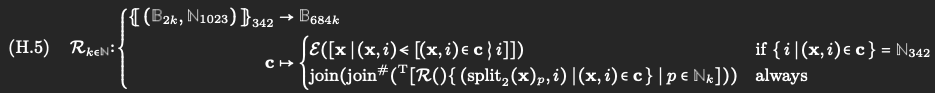
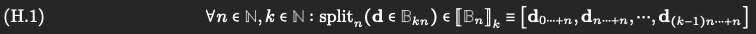
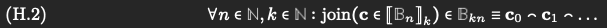

# Erasure Coding 實作細節

## 用途
分別在 import DA, Audit DA 使用, 會有不同大小



## Encode/Decode function in GP
- Reed-Solomon erasure coding function in gf(2^16) of rate 342:1023
- RS Encode function: 把 342 組 2-byte octet pairs 擴展成 1023 組
    - B₂₃₄₂ → B₂₁₀₂₃
- RS Recover function：從 342組 (2byte, index) 還原成一組342個 octet pairs
    - {(B₂, N₁₀₂₃)}₃₄₂ → B₂₃₄₂
- Erasure-coding  encode/decode using RS function:
    - 
    - 
- split, join 補充 function
    - 
    - 

## Encode 詳細流程解釋
1. Padding
    - 如果資料不是 684 bytes 的倍數，補 0 對齊。
2. 拆 Chunk
    - 切成 342 組：
    ```
    [[chunk0], [chunk1], [chunk2], ...]_342  共342組
    ```
    - 每組有 total_bytes / 684 個 2-byte octet pairs。
3. 每組切2-byte
    ```
    [[0x00aa, 0x00bb, ...]_N,
     [0x10aa, 0x10bb, ...],
     [0x20aa, 0x20bb, ...]]_342
     ```
4. Transpose
    - 將矩陣從 342 x N 轉為 N x 342：
    ```
    [[0x00aa, 0x10aa, 0x20aa, ...]_342, 
     [0x00bb, 0x10bb, 0x20bb, ...], 
     ...]_N
    ```
5. Reed-Solomon Encoding
    - 每個 row 用 RS encoding：
    ```
    [0x00aa, 0x10aa, 0x20aa, ...]_342 ⇒ [0x0aaa, 0x1aaa, 0x2aaa, ..., ]_1023
    ```
    - 輸出 1023 個 elements。
6. Transpose
    - N x 1023 → 1023 x N：
    ```
    [[0x0aaa, 0x0bbb, 0x0ccc, ...]_N,
     [0x1aaa, 0x1bbb, 0x1ccc, ...],
     ...]_1023
    ```
7. Flatten
    - 生成 1023 個 shards，每個都是 N*2 bytes：
    ```
    [0x0aaa0bbb0ccc..., 0x1aaa1bbb1ccc..., ...]_1023
    ```
    
## Decode 詳細流程解釋
1. 輸入 Shards
    ```
    [0x0aaa0bbb0ccc..., 0x1aaa1bbb1ccc..., ...]_342
    ```
2. 拆成2-byte
    - 分割成矩陣：
    ```
    [[0x0aaa, 0x0bbb, ...]_N,
     [0x1aaa, 0x1bbb, ...],
     ...]_342
    ```
3. RS Decode
    - 用 shards 和 index 做 decode ex: (0x0aaa, 0) (0x1aaa, 1)
    ```
    [0x0aaa, 0x1aaa, ...]_342 → [0x00aa, 0x10aa, ...]_342
     ```
4. Transpose
    - 還原為原始矩陣：
    ```
    [[0x00aa, 0x00bb, ...]_N,
     [0x10aa, 0x10bb, ...],
     ...]_342
    ```
5. Flatten:
    - 拼回 bytes
    ```
    0x00aa00bb...10aa10bb...
    ```
## Tiny/Full
1. Full Mode (342→1023)
    - 1023 個 validators
    - 342 個 data shards
    - 681 個 parity shards

2. Tiny Mode (2→6)
    - 6 個 validators
    - 2 個 data shards
    - 4 個 parity shards

## 目前實作模式
- 使用 Rust reed-solomon-simd library
    - https://docs.rs/reed-solomon-simd/3.0.1/reed_solomon_simd/
- 用 ffi 從 golang 串接
- Rust
    1. 對整體資料做 Padding
    2. 切 Chunk（每個 chunk 是 shard unit）
    3. 每 Chunk 呼叫 RS encoding
    4. 組合 Data + Parity chunk
    5. Flatten 成 shard-major 順序(方便分配給每個 validator)
    6. 回傳一個 flattened bytes pointer
- Golang
    1. 複製回 slice
    2. 把資料拆成每個 shard

## Test vectors
https://github.com/davxy/jam-test-vectors/tree/master/erasure